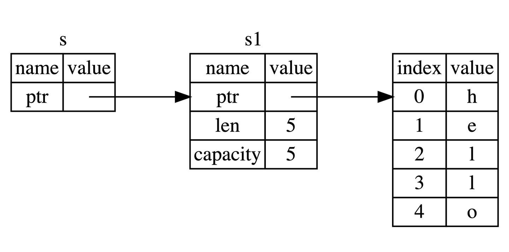

# 所有权和借用

Rust 之所以能成为万众瞩目的语言，就是因为其内存安全性。在以往，内存安全几乎都是通过 GC 的方式实现，但是 GC 会引来性能、内存占用以及 Stop the world 等问题，在高性能场景和系统编程上是不可接受的，因此 Rust 采用了与 ( 不 ) 众 ( 咋 ) 不 ( 好 ) 同 ( 学 )的方式：**所有权系统**。

理解**所有权**和**借用**，对于 Rust 学习是至关重要的，因此我们把本章提到了非常靠前的位置，So，在座的各位，有一个算一个，准备好了嘛？

从现在开始，鉴于大家已经掌握了非常基本的语法，有些时候，在示例代码中，将省略 `fn main() {}` 的模版代码，只要将相应的示例放在 `fn main() {}` 中，即可运行。

## 所有权

所有的程序都必须和计算机内存打交道，如何从内存中申请空间来存放程序的运行内容，如何在不需要的时候释放这些空间，成了重中之重，也是所有编程语言设计的难点之一。在计算机语言不断演变过程中，出现了三种流派：

* **垃圾回收机制(GC)**，在程序运行时不断寻找不再使用的内存，典型代表：Java、Go
* **手动管理内存的分配和释放**, 在程序中，通过函数调用的方式来申请和释放内存，典型代表：C++
* **通过所有权来管理内存**，编译器在编译时会根据一系列规则进行检查

其中 Rust 选择了第三种，最妙的是，这种检查只发生在编译期，因此对于程序运行期，不会有任何性能上的损失。

### [一段不安全的代码](https://course.rs/basic/ownership/ownership.html#%E4%B8%80%E6%AE%B5%E4%B8%8D%E5%AE%89%E5%85%A8%E7%9A%84%E4%BB%A3%E7%A0%81) <a href="#yi-duan-bu-an-quan-de-dai-ma" id="yi-duan-bu-an-quan-de-dai-ma"></a>

先来看看一段来自 C 语言的糟糕代码：

```c
// Some code
int* foo() {
    int a;          // 变量a的作用域开始
    a = 100;
    char *c = "xyz";   // 变量c的作用域开始
    return &a;
}                   // 变量a和c的作用域结束

```

这段代码虽然可以编译通过，但是其实非常糟糕，变量 `a` 和 `c` 都是局部变量，函数结束后将局部变量 `a` 的地址返回，但局部变量 `a` 存在栈中，在离开作用域后，`a` 所申请的栈上内存都会被系统回收，从而造成了 `悬空指针(Dangling Pointer)` 的问题。这是一个非常典型的内存安全问题，虽然编译可以通过，但是运行的时候会出现错误，很多编程语言都存在.

再来看变量 `c`，`c` 的值是常量字符串，存储于常量区，可能这个函数我们只调用了一次，也可能我们不再会使用这个字符串，但 `"xyz"` 只有当整个程序结束后系统才能回收这片内存。

所以内存安全问题，一直都是程序员非常头疼的问题，好在，在 Rust 中这些问题即将成为历史，因为 Rust 在编译的时候就可以帮助我们发现内存不安全的问题，那 Rust 如何做到这一点呢？

### [栈(Stack)与堆(Heap)](https://course.rs/basic/ownership/ownership.html#%E6%A0%88stack%E4%B8%8E%E5%A0%86heap) <a href="#zhan-stack-yu-dui-heap" id="zhan-stack-yu-dui-heap"></a>

栈和堆是编程语言最核心的数据结构，但是在很多语言中，你并不需要深入了解栈与堆。 但对于 Rust 这样的系统编程语言，值是位于栈上还是堆上非常重要，因为这会影响程序的行为和性能。

栈和堆的核心目标就是为程序在运行时提供可供使用的内存空间。

#### [**栈**](https://course.rs/basic/ownership/ownership.html#%E6%A0%88)

栈按照顺序存储值并以相反顺序取出值，这也被称作**后进先出**。想象一下一叠盘子：当增加更多盘子时，把它们放在盘子堆的顶部，当需要盘子时，再从顶部拿走。不能从中间也不能从底部增加或拿走盘子！

增加数据叫做**进栈**，移出数据则叫做**出栈**。

因为上述的实现方式，栈中的所有数据都必须占用已知且固定大小的内存空间，假设数据大小是未知的，那么在取出数据时，你将无法取到你想要的数据。

#### [**堆**](https://course.rs/basic/ownership/ownership.html#%E5%A0%86)

与栈不同，对于大小未知或者可能变化的数据，我们需要将它存储在堆上。

当向堆上放入数据时，需要请求一定大小的内存空间。操作系统在堆的某处找到一块足够大的空位，把它标记为已使用，并返回一个表示该位置地址的**指针**，该过程被称为**在堆上分配内存**，有时简称为 “分配”(allocating)。

接着，该指针会被推入**栈**中，因为指针的大小是已知且固定的，在后续使用过程中，你将通过栈中的**指针**，来获取数据在堆上的实际内存位置，进而访问该数据。

由上可知，堆是一种缺乏组织的数据结构。想象一下去餐馆就座吃饭：进入餐馆，告知服务员有几个人，然后服务员找到一个够大的空桌子（堆上分配的内存空间）并领你们过去。如果有人来迟了，他们也可以通过桌号（栈上的指针）来找到你们坐在哪。

[**性能区别**](https://course.rs/basic/ownership/ownership.html#%E6%80%A7%E8%83%BD%E5%8C%BA%E5%88%AB)

在栈上分配内存比在堆上分配内存要快，因为入栈时操作系统无需进行函数调用（或更慢的系统调用）来分配新的空间，只需要将新数据放入栈顶即可。相比之下，在堆上分配内存则需要更多的工作，这是因为操作系统必须首先找到一块足够存放数据的内存空间，接着做一些记录为下一次分配做准备，如果当前进程分配的内存页不足时，还需要进行系统调用来申请更多内存。 因此，处理器在栈上分配数据会比在堆上分配数据更加高效。

[**所有权与堆栈**](https://course.rs/basic/ownership/ownership.html#%E6%89%80%E6%9C%89%E6%9D%83%E4%B8%8E%E5%A0%86%E6%A0%88)

当你的代码调用一个函数时，传递给函数的参数（包括可能指向堆上数据的指针和函数的局部变量）依次被压入栈中，当函数调用结束时，这些值将被从栈中按照相反的顺序依次移除。

因为堆上的数据缺乏组织，因此跟踪这些数据何时分配和释放是非常重要的，否则堆上的数据将产生内存泄漏 —— 这些数据将永远无法被回收。这就是 Rust 所有权系统为我们提供的强大保障。

对于其他很多编程语言，你确实无需理解堆栈的原理，但是**在 Rust 中，明白堆栈的原理，对于我们理解所有权的工作原理会有很大的帮助**。

### [所有权原则](https://course.rs/basic/ownership/ownership.html#%E6%89%80%E6%9C%89%E6%9D%83%E5%8E%9F%E5%88%99) <a href="#suo-you-quan-yuan-ze" id="suo-you-quan-yuan-ze"></a>

理解了堆栈，接下来看一&#x4E0B;_&#x5173;于所有权的规则_，首先请谨记以下规则：

1. Rust 中每一个值都被一个变量所拥有，该变量被称为值的所有者
2. 一个值同时只能被一个变量所拥有，或者说一个值只能拥有一个所有者
3. 当所有者（变量）离开作用域范围时，这个值将被丢弃(drop)

#### [**变量作用域**](https://course.rs/basic/ownership/ownership.html#%E5%8F%98%E9%87%8F%E4%BD%9C%E7%94%A8%E5%9F%9F)

作用域是一个变量在程序中有效的范围，假如有这样一个变量：

```rust
// Some code
let s = "hello";
```

变量 `s` 绑定到了一个字符串字面值，该字符串字面值是硬编码到程序代码中的。`s` 变量从声明的点开始直到当前作用域的结束都是有效的：

```rust
// Some code
{                      // s 在这里无效，它尚未声明
    let s = "hello";   // 从此处起，s 是有效的

    // 使用 s
}                      // 此作用域已结束，s不再有效

```

简而言之，`s` 从创建开始就有效，然后有效期持续到它离开作用域为止，可以看出，就作用域来说，Rust 语言跟其他编程语言没有区别。

#### [**简单介绍 String 类型**](https://course.rs/basic/ownership/ownership.html#%E7%AE%80%E5%8D%95%E4%BB%8B%E7%BB%8D-string-%E7%B1%BB%E5%9E%8B)

之前提到过，本章会用 `String` 作为例子，因此这里会进行一下简单的介绍，具体的 `String` 学习请参见 [String 类型](https://course.rs/basic/compound-type/string-slice.html)。

我们已经见过字符串字面值 `let s = "hello"`，`s` 是被硬编码进程序里的字符串值（类型为 `&str` ）。字符串字面值是很方便的，但是它并不适用于所有场景。原因有二：

* **字符串字面值是不可变的**，因为被硬编码到程序代码中
* 并非所有字符串的值都能在编写代码时得知

例如，字符串是需要程序运行时，通过用户动态输入然后存储在内存中的，这种情况，字符串字面值就完全无用武之地。 为此，Rust 为我们提供动态字符串类型: `String`，该类型被分配到堆上，因此可以动态伸缩，也就能存储在编译时大小未知的文本。

可以使用下面的方法基于字符串字面量来创建 `String` 类型：

```rust
// Some code
let s = String::from("hello");
```

`::` 是一种调用操作符，这里表示调用 `String` 类型中的 `from` 关联函数，由于 `String` 类型存储在堆上，因此它是动态的，你可以这样修改：

```rust
// Some code
let mut s = String::from("hello");

s.push_str(", world!"); // push_str() 在字符串后追加字面值

println!("{}", s); // 将打印 `hello, world!`

```

### [变量绑定背后的数据交互](https://course.rs/basic/ownership/ownership.html#%E5%8F%98%E9%87%8F%E7%BB%91%E5%AE%9A%E8%83%8C%E5%90%8E%E7%9A%84%E6%95%B0%E6%8D%AE%E4%BA%A4%E4%BA%92) <a href="#bian-liang-bang-ding-bei-hou-de-shu-ju-jiao-hu" id="bian-liang-bang-ding-bei-hou-de-shu-ju-jiao-hu"></a>

#### [**转移所有权**](https://course.rs/basic/ownership/ownership.html#%E8%BD%AC%E7%A7%BB%E6%89%80%E6%9C%89%E6%9D%83)

先来看一段代码

```rust
// Some code
let x = 5;
let y = x;
```

这段代码并没有发生所有权的转移，原因很简单： 代码首先将 `5` 绑定到变量 `x`，接着**拷贝** `x` 的值赋给 `y`，最终 `x` 和 `y` 都等于 `5`，因为整数是 Rust 基本数据类型，是固定大小的简单值，因此这两个值都是通过**自动拷贝**的方式来赋值的，都被存在栈中，完全无需在堆上分配内存。

整个过程中的赋值都是通过值拷贝的方式完成（发生在栈中），因此并不需要所有权转移。

可能有同学会有疑问：这种拷贝不消耗性能吗？实际上，这种栈上的数据足够简单，而且拷贝非常非常快，只需要复制一个整数大小（`i32`，4 个字节）的内存即可，因此在这种情况下，拷贝的速度远比在堆上创建内存来得快的多。实际上，上一章我们讲到的 Rust 基本类型都是通过自动拷贝的方式来赋值的，就像上面代码一样。

然后再来看一段代码：

```rust
// Some code
let s1 = String::from("hello");
let s2 = s1;

```

此时，可能某个大聪明( 善意昵称 )已经想到了：嗯，上面一样，把 `s1` 的内容拷贝一份赋值给 `s2`，实际上，并不是这样。之前也提到了，对于基本类型（存储在栈上），Rust 会自动拷贝，但是 `String` 不是基本类型，而且是存储在堆上的，因此不能自动拷贝。

实际上， `String` 类型是一个复杂类型，由存储在栈中的**堆指针**、**字符串长度**、**字符串容量**共同组成，其中**堆指针**是最重要的，它指向了真实存储字符串内容的堆内存，至于长度和容量，如果你有 Go 语言的经验，这里就很好理解：容量是堆内存分配空间的大小，长度是目前已经使用的大小。

总之 `String` 类型指向了一个堆上的空间，这里存储着它的真实数据，下面对上面代码中的 `let s2 = s1` 分成两种情况讨论：

1. 拷贝 `String` 和存储在堆上的字节数组 如果该语句是拷贝所有数据(深拷贝)，那么无论是 `String` 本身还是底层的堆上数据，都会被全部拷贝，这对于性能而言会造成非常大的影响
2. 只拷贝 `String` 本身 这样的拷贝非常快，因为在 64 位机器上就拷贝了 `8字节的指针`、`8字节的长度`、`8字节的容量`，总计 24 字节，但是带来了新的问题，还记得我们之前提到的所有权规则吧？其中有一条就是：**一个值只允许有一个所有者**，而现在这个值（堆上的真实字符串数据）有了两个所有者：`s1` 和 `s2`。

好吧，就假定一个值可以拥有两个所有者，会发生什么呢？

当变量离开作用域后，Rust 会自动调用 `drop` 函数并清理变量的堆内存。不过由于两个 `String` 变量指向了同一位置。这就有了一个问题：当 `s1` 和 `s2` 离开作用域，它们都会尝试释放相同的内存。这是一个叫做 **二次释放（double free）** 的错误，也是之前提到过的内存安全性 BUG 之一。两次释放（相同）内存会导致内存污染，它可能会导致潜在的安全漏洞。

因此，Rust 这样解决问题：**当 `s1` 被赋予 `s2` 后，Rust 认为 `s1` 不再有效，因此也无需在 `s1` 离开作用域后 `drop` 任何东西，这就是把所有权从 `s1` 转移给了 `s2`，`s1` 在被赋予 `s2` 后就马上失效了**。

再来看看，在所有权转移后再来使用旧的所有者，会发生什么：

```rust
// Some code
let s1 = String::from("hello");
let s2 = s1;

println!("{}, world!", s1);

```

由于 Rust 禁止你使用无效的引用，你会看到以下的错误：

```
// Some code
error[E0382]: borrow of moved value: `s1`
 --> src/main.rs:5:28
  |
2 |     let s1 = String::from("hello");
  |         -- move occurs because `s1` has type `String`, which does not implement the `Copy` trait
3 |     let s2 = s1;
  |              -- value moved here
4 |
5 |     println!("{}, world!", s1);
  |                            ^^ value borrowed here after move
  |
  = note: this error originates in the macro `$crate::format_args_nl` which comes from the expansion of the macro `println` (in Nightly builds, run with -Z macro-backtrace for more info)
help: consider cloning the value if the performance cost is acceptable
  |
3 |     let s2 = s1.clone();
  |                ++++++++

For more information about this error, try `rustc --explain E0382`.

```

如果你在其他语言中听说过术语 **浅拷贝(shallow copy)** 和 **深拷贝(deep copy)**，那么拷贝指针、长度和容量而不拷贝数据听起来就像浅拷贝，但是又因为 Rust 同时使第一个变量 `s1` 无效了，因此这个操作被称为 **移动(move)**，而不是浅拷贝。上面的例子可以解读为 `s1` 被**移动**到了 `s2` 中。那么具体发生了什么，用一张图简单说明：

<figure><figcaption></figcaption></figure>

这样就解决了我们之前的问题，`s1` 不再指向任何数据，只有 `s2` 是有效的，当 `s2` 离开作用域，它就会释放内存。 相信此刻，你应该明白了，为什么 Rust 称呼 `let a = b` 为**变量绑定**了吧？

再来看一段代码:

```rust
// Some code
fn main() {
    let x: &str = "hello, world";
    let y = x;
    println!("{},{}",x,y);
}
```

这段代码和之前的 `String` 有一个本质上的区别：在 `String` 的例子中 `s1` 持有了通过`String::from("hello")` 创建的值的所有权，而这个例子中，`x` 只是引用了存储在二进制可执行文件( binary )中的字符串 `"hello, world"`，并没有持有所有权。

因此 `let y = x` 中，仅仅是对该引用进行了拷贝，此时 `y` 和 `x` 都引用了同一个字符串。**如果还不理解也没关系，当学习了下一章节 "引用与借用" 后，大家自然而言就会理解。**

[**克隆(深拷贝)**](https://course.rs/basic/ownership/ownership.html#%E5%85%8B%E9%9A%86%E6%B7%B1%E6%8B%B7%E8%B4%9D)

首先，**Rust 永远也不会自动创建数据的 “深拷贝”**。因此，任何**自动**的复制都不是深拷贝，可以被认为对运行时性能影响较小。

如果我们**确实**需要深度复制 `String` 中堆上的数据，而不仅仅是栈上的数据，可以使用一个叫做 `clone` 的方法。

```rust
// Some code
let s1 = String::from("hello");
let s2 = s1.clone();

println!("s1 = {}, s2 = {}", s1, s2);

```

这段代码能够正常运行，说明 `s2` 确实完整的复制了 `s1` 的数据。

如果代码性能无关紧要，例如初始化程序时或者在某段时间只会执行寥寥数次时，你可以使用 `clone` 来简化编程。但是对于执行较为频繁的代码（热点路径），使用 `clone` 会极大的降低程序性能，需要小心使用！

[**拷贝(浅拷贝)**](https://course.rs/basic/ownership/ownership.html#%E6%8B%B7%E8%B4%9D%E6%B5%85%E6%8B%B7%E8%B4%9D)

浅拷贝只发生在栈上，因此性能很高，在日常编程中，浅拷贝无处不在。

再回到之前看过的例子:

```rust
// Some code
let x = 5;
let y = x;

println!("x = {}, y = {}", x, y);

```

但这段代码似乎与我们刚刚学到的内容相矛盾：没有调用 `clone`，不过依然实现了类似深拷贝的效果 —— 没有报所有权的错误。

原因是像整型这样的基本类型在编译时是已知大小的，会被存储在栈上，所以拷贝其实际的值是快速的。这意味着没有理由在创建变量 `y` 后使 `x` 无效（`x`、`y` 都仍然有效）。换句话说，这里没有深浅拷贝的区别，因此这里调用 `clone` 并不会与通常的浅拷贝有什么不同，我们可以不用管它（可以理解成在栈上做了深拷贝）。

Rust 有一个叫做 `Copy` 的特征，可以用在类似整型这样在栈中存储的类型。如果一个类型拥有 `Copy` 特征，一个旧的变量在被赋值给其他变量后仍然可用，也就是赋值的过程即是拷贝的过程。

那么什么类型是可 `Copy` 的呢？可以查看给定类型的文档来确认，这里可以给出一个通用的规则： **任何基本类型的组合可以 `Copy` ，不需要分配内存或某种形式资源的类型是可以 `Copy` 的**。如下是一些 `Copy` 的类型：

* 所有整数类型，比如 `u32`
* 布尔类型，`bool`，它的值是 `true` 和 `false`
* 所有浮点数类型，比如 `f64`
* 字符类型，`char`
* 元组，当且仅当其包含的类型也都是 `Copy` 的时候。比如，`(i32, i32)` 是 `Copy` 的，但 `(i32, String)` 就不是
* 不可变引用 `&T` ，例如[转移所有权](https://course.rs/basic/ownership/ownership.html#%E8%BD%AC%E7%A7%BB%E6%89%80%E6%9C%89%E6%9D%83)中的最后一个例子，**但是注意：可变引用 `&mut T` 是不可以 Copy**

### [函数传值与返回](https://course.rs/basic/ownership/ownership.html#%E5%87%BD%E6%95%B0%E4%BC%A0%E5%80%BC%E4%B8%8E%E8%BF%94%E5%9B%9E) <a href="#han-shu-chuan-zhi-yu-fan-hui" id="han-shu-chuan-zhi-yu-fan-hui"></a>

将值传递给函数，一样会发生 `移动` 或者 `复制`，就跟 `let` 语句一样，下面的代码展示了所有权、作用域的规则：

```rust
// Some code
fn main() {
    let s = String::from("hello");  // s 进入作用域

    takes_ownership(s);             // s 的值移动到函数里 ...
                                    // ... 所以到这里不再有效

    let x = 5;                      // x 进入作用域

    makes_copy(x);                  // x 应该移动函数里，
                                    // 但 i32 是 Copy 的，所以在后面可继续使用 x

} // 这里, x 先移出了作用域，然后是 s。但因为 s 的值已被移走，
  // 所以不会有特殊操作

fn takes_ownership(some_string: String) { // some_string 进入作用域
    println!("{}", some_string);
} // 这里，some_string 移出作用域并调用 `drop` 方法。占用的内存被释放

fn makes_copy(some_integer: i32) { // some_integer 进入作用域
    println!("{}", some_integer);
} // 这里，some_integer 移出作用域。不会有特殊操作
```

你可以尝试在 `takes_ownership` 之后，再使用 `s`，看看如何报错？例如添加一行 `println!("在move进函数后继续使用s: {}",s);`。

同样的，函数返回值也有所有权，例如:

```rust
// Some code
fn main() {
    let s1 = gives_ownership();         // gives_ownership 将返回值
                                        // 移给 s1

    let s2 = String::from("hello");     // s2 进入作用域

    let s3 = takes_and_gives_back(s2);  // s2 被移动到
                                        // takes_and_gives_back 中,
                                        // 它也将返回值移给 s3
} // 这里, s3 移出作用域并被丢弃。s2 也移出作用域，但已被移走，
  // 所以什么也不会发生。s1 移出作用域并被丢弃

fn gives_ownership() -> String {             // gives_ownership 将返回值移动给
                                             // 调用它的函数

    let some_string = String::from("hello"); // some_string 进入作用域.

    some_string                              // 返回 some_string 并移出给调用的函数
}

// takes_and_gives_back 将传入字符串并返回该值
fn takes_and_gives_back(a_string: String) -> String { // a_string 进入作用域

    a_string  // 返回 a_string 并移出给调用的函数
}
```

所有权很强大，避免了内存的不安全性，但是也带来了一个新麻烦： **总是把一个值传来传去来使用它**。 传入一个函数，很可能还要从该函数传出去，结果就是语言表达变得非常啰嗦，幸运的是，Rust 提供了新功能解决这个问题。

## 引用与借用

上节中提到，如果仅仅支持通过转移所有权的方式获取一个值，那会让程序变得复杂。 Rust 能否像其它编程语言一样，使用某个变量的指针或者引用呢？答案是可以。

Rust 通过 `借用(Borrowing)` 这个概念来达成上述的目的，**获取变量的引用，称之为借用(borrowing)**。正如现实生活中，如果一个人拥有某样东西，你可以从他那里借来，当使用完毕后，也必须要物归原主。

### [引用与解引用](https://course.rs/basic/ownership/borrowing.html#%E5%BC%95%E7%94%A8%E4%B8%8E%E8%A7%A3%E5%BC%95%E7%94%A8) <a href="#yin-yong-yu-jie-yin-yong" id="yin-yong-yu-jie-yin-yong"></a>

常规引用是一个指针类型，指向了对象存储的内存地址。在下面代码中，我们创建一个 `i32` 值的引用 `y`，然后使用解引用运算符来解出 `y` 所使用的值:

```rust
// Some code
fn main() {
    let x = 5;
    let y = &x;

    assert_eq!(5, x);
    assert_eq!(5, *y);
}
```

变量 `x` 存放了一个 `i32` 值 `5`。`y` 是 `x` 的一个引用。可以断言 `x` 等于 `5`。然而，如果希望对 `y` 的值做出断言，必须使用 `*y` 来解出引用所指向的值（也就是**解引用**）。一旦解引用了 `y`，就可以访问 `y` 所指向的整型值并可以与 `5` 做比较。

相反如果尝试编写 `assert_eq!(5, y);`，则会得到如下编译错误：

```
// Some code
error[E0277]: can't compare `{integer}` with `&{integer}`
 --> src/main.rs:6:5
  |
6 |     assert_eq!(5, y);
  |     ^^^^^^^^^^^^^^^^^ no implementation for `{integer} == &{integer}` // 无法比较整数类型和引用类型
  |
  = help: the trait `std::cmp::PartialEq<&{integer}>` is not implemented for
  `{integer}`

```

不允许比较整数与引用，因为它们是不同的类型。必须使用解引用运算符解出引用所指向的值。

### [不可变引用](https://course.rs/basic/ownership/borrowing.html#%E4%B8%8D%E5%8F%AF%E5%8F%98%E5%BC%95%E7%94%A8) <a href="#bu-ke-bian-yin-yong" id="bu-ke-bian-yin-yong"></a>

下面的代码，我们用 `s1` 的引用作为参数传递给 `calculate_length` 函数，而不是把 `s1` 的所有权转移给该函数：

```rust
// Some code
fn main() {
    let s1 = String::from("hello");

    let len = calculate_length(&s1);

    println!("The length of '{}' is {}.", s1, len);
}

fn calculate_length(s: &String) -> usize {
    s.len()
}
```

能注意到两点：

1. 无需像上章一样：先通过函数参数传入所有权，然后再通过函数返回来传出所有权，代码更加简洁
2. `calculate_length` 的参数 `s` 类型从 `String` 变为 `&String`

这里，`&` 符号即是引用，它们允许你使用值，但是不获取所有权，如图所示：

<figure><figcaption></figcaption></figure>

通过 `&s1` 语法，我们创建了一个**指向 `s1` 的引用**，但是并不拥有它。因为并不拥有这个值，当引用离开作用域后，其指向的值也不会被丢弃。

同理，函数 `calculate_length` 使用 `&` 来表明参数 `s` 的类型是一个引用：

```rust
// Some code
fn calculate_length(s: &String) -> usize { // s 是对 String 的引用
    s.len()
} // 这里，s 离开了作用域。但因为它并不拥有引用值的所有权，
  // 所以什么也不会发生

```

如果尝试修改借用的变量呢？

```rust
// Some code
fn main() {
    let s = String::from("hello");

    change(&s);
}

fn change(some_string: &String) {
    some_string.push_str(", world");
}
```

```
// Some code
error[E0596]: cannot borrow `*some_string` as mutable, as it is behind a `&` reference
 --> src/main.rs:8:5
  |
7 | fn change(some_string: &String) {
  |                        ------- help: consider changing this to be a mutable reference: `&mut String`
                           ------- 帮助：考虑将该参数类型修改为可变的引用: `&mut String`
8 |     some_string.push_str(", world");
  |     ^^^^^^^^^^^ `some_string` is a `&` reference, so the data it refers to cannot be borrowed as mutable
                     `some_string`是一个`&`类型的引用，因此它指向的数据无法进行修改

```

正如变量默认不可变一样，引用指向的值默认也是不可变的，没事，来一起看看如何解决这个问题。

### [可变引用](https://course.rs/basic/ownership/borrowing.html#%E5%8F%AF%E5%8F%98%E5%BC%95%E7%94%A8) <a href="#ke-bian-yin-yong" id="ke-bian-yin-yong"></a>

只需要一个小调整，即可修复上面代码的错误：

```rust
// Some code
fn main() {
    let mut s = String::from("hello");

    change(&mut s);
}

fn change(some_string: &mut String) {
    some_string.push_str(", world");
}
```

首先，声明 `s` 是可变类型，其次创建一个可变的引用 `&mut s` 和接受可变引用参数 `some_string: &mut String` 的函数。

[**可变引用同时只能存在一个**](https://course.rs/basic/ownership/borrowing.html#%E5%8F%AF%E5%8F%98%E5%BC%95%E7%94%A8%E5%90%8C%E6%97%B6%E5%8F%AA%E8%83%BD%E5%AD%98%E5%9C%A8%E4%B8%80%E4%B8%AA)

不过可变引用并不是随心所欲、想用就用的，它有一个很大的限制： **同一作用域，特定数据只能有一个可变引用**：

```rust
// Some code
let mut s = String::from("hello");

let r1 = &mut s;
let r2 = &mut s;

println!("{}, {}", r1, r2);

```

以上代码会报错：

```
// Some code
error[E0499]: cannot borrow `s` as mutable more than once at a time 同一时间无法对 `s` 进行两次可变借用
 --> src/main.rs:5:14
  |
4 |     let r1 = &mut s;
  |              ------ first mutable borrow occurs here 首个可变引用在这里借用
5 |     let r2 = &mut s;
  |              ^^^^^^ second mutable borrow occurs here 第二个可变引用在这里借用
6 |
7 |     println!("{}, {}", r1, r2);
  |                        -- first borrow later used here 第一个借用在这里使用

```

这段代码出错的原因在于，第一个可变借用 `r1` 必须要持续到最后一次使用的位置 `println!`，在 `r1` 创建和最后一次使用之间，我们又尝试创建第二个可变借用 `r2`。

对于新手来说，这个特性绝对是一大拦路虎，也是新人们谈之色变的编译器 `borrow checker` 特性之一，不过各行各业都一样，限制往往是出于安全的考虑，Rust 也一样。

这种限制的好处就是使 Rust 在编译期就避免数据竞争，数据竞争可由以下行为造成：

* 两个或更多的指针同时访问同一数据
* 至少有一个指针被用来写入数据
* 没有同步数据访问的机制

数据竞争会导致未定义行为，这种行为很可能超出我们的预期，难以在运行时追踪，并且难以诊断和修复。而 Rust 避免了这种情况的发生，因为它甚至不会编译存在数据竞争的代码！

很多时候，大括号可以帮我们解决一些编译不通过的问题，通过手动限制变量的作用域：

```rust
// Some code
let mut s = String::from("hello");

{
    let r1 = &mut s;

} // r1 在这里离开了作用域，所以我们完全可以创建一个新的引用

let r2 = &mut s;

```

[**可变引用与不可变引用不能同时存在**](https://course.rs/basic/ownership/borrowing.html#%E5%8F%AF%E5%8F%98%E5%BC%95%E7%94%A8%E4%B8%8E%E4%B8%8D%E5%8F%AF%E5%8F%98%E5%BC%95%E7%94%A8%E4%B8%8D%E8%83%BD%E5%90%8C%E6%97%B6%E5%AD%98%E5%9C%A8)

下面的代码会导致一个错误：

```rust
// Some code
let mut s = String::from("hello");

let r1 = &s; // 没问题
let r2 = &s; // 没问题
let r3 = &mut s; // 大问题

println!("{}, {}, and {}", r1, r2, r3);

```

```
// Some code
error[E0502]: cannot borrow `s` as mutable because it is also borrowed as immutable
        // 无法借用可变 `s` 因为它已经被借用了不可变
 --> src/main.rs:6:14
  |
4 |     let r1 = &s; // 没问题
  |              -- immutable borrow occurs here 不可变借用发生在这里
5 |     let r2 = &s; // 没问题
6 |     let r3 = &mut s; // 大问题
  |              ^^^^^^ mutable borrow occurs here 可变借用发生在这里
7 |
8 |     println!("{}, {}, and {}", r1, r2, r3);
  |                                -- immutable borrow later used here 不可变借用在这里使用

```

其实这个也很好理解，正在借用不可变引用的用户，肯定不希望他借用的东西，被另外一个人莫名其妙改变了。多个不可变借用被允许是因为没有人会去试图修改数据，每个人都只读这一份数据而不做修改，因此不用担心数据被污染。

> 注意，引用的作用域 `s` 从创建开始，一直持续到它最后一次使用的地方，这个跟变量的作用域有所不同，变量的作用域从创建持续到某一个花括号 `}`

Rust 的编译器一直在优化，早期的时候，引用的作用域跟变量作用域是一致的，这对日常使用带来了很大的困扰，你必须非常小心的去安排可变、不可变变量的借用，免得无法通过编译，例如以下代码：

```rust
// Some code
fn main() {
   let mut s = String::from("hello");

    let r1 = &s;
    let r2 = &s;
    println!("{} and {}", r1, r2);
    // 新编译器中，r1,r2作用域在这里结束

    let r3 = &mut s;
    println!("{}", r3);
} // 老编译器中，r1、r2、r3作用域在这里结束
  // 新编译器中，r3作用域在这里结束
```

在老版本的编译器中（Rust 1.31 前），将会报错，因为 `r1` 和 `r2` 的作用域在花括号 `}` 处结束，那么 `r3` 的借用就会触发 **无法同时借用可变和不可变** 的规则。

但是在新的编译器中，该代码将顺利通过，因为 **引用作用域的结束位置从花括号变成最后一次使用的位置**，因此 `r1` 借用和 `r2` 借用在 `println!` 后，就结束了，此时 `r3` 可以顺利借用到可变引用。

[**NLL**](https://course.rs/basic/ownership/borrowing.html#nll)

对于这种编译器优化行为，Rust 专门起了一个名字 —— **Non-Lexical Lifetimes(NLL)**，专门用于找到某个引用在作用域(`}`)结束前就不再被使用的代码位置。

虽然这种借用错误有的时候会让我们很郁闷，但是你只要想想这是 Rust 提前帮你发现了潜在的 BUG，其实就开心了，虽然减慢了开发速度，但是从长期来看，大幅减少了后续开发和运维成本。

#### [悬垂引用(Dangling References)](https://course.rs/basic/ownership/borrowing.html#%E6%82%AC%E5%9E%82%E5%BC%95%E7%94%A8dangling-references) <a href="#xuan-chui-yin-yong-danglingreferences" id="xuan-chui-yin-yong-danglingreferences"></a>

悬垂引用也叫做悬垂指针，意思为指针指向某个值后，这个值被释放掉了，而指针仍然存在，其指向的内存可能不存在任何值或已被其它变量重新使用。在 Rust 中编译器可以确保引用永远也不会变成悬垂状态：当你获取数据的引用后，编译器可以确保数据不会在引用结束前被释放，要想释放数据，必须先停止其引用的使用。

让我们尝试创建一个悬垂引用，Rust 会抛出一个编译时错误：

```
// Some code
fn main() {
    let reference_to_nothing = dangle();
}

fn dangle() -> &String {
    let s = String::from("hello");

    &s
}
```

```
// Some code
error[E0106]: missing lifetime specifier
 --> src/main.rs:5:16
  |
5 | fn dangle() -> &String {
  |                ^ expected named lifetime parameter
  |
  = help: this function's return type contains a borrowed value, but there is no value for it to be borrowed from
help: consider using the `'static` lifetime
  |
5 | fn dangle() -> &'static String {
  |                ~~~~~~~~

```

错误信息引用了一个我们还未介绍的功能：[生命周期(lifetimes)](https://course.rs/basic/lifetime.html)。不过，即使你不理解生命周期，也可以通过错误信息知道这段代码错误的关键信息：

```
// Some code
this function's return type contains a borrowed value, but there is no value for it to be borrowed from.
该函数返回了一个借用的值，但是已经找不到它所借用值的来源

```

仔细看看 `dangle` 代码的每一步到底发生了什么：

```
// Some code
fn dangle() -> &String { // dangle 返回一个字符串的引用

    let s = String::from("hello"); // s 是一个新字符串

    &s // 返回字符串 s 的引用
} // 这里 s 离开作用域并被丢弃。其内存被释放。
  // 危险！

```

因为 `s` 是在 `dangle` 函数内创建的，当 `dangle` 的代码执行完毕后，`s` 将被释放，但是此时我们又尝试去返回它的引用。这意味着这个引用会指向一个无效的 `String`，这可不对！

其中一个很好的解决方法是直接返回 `String`：

```
// Some code
fn no_dangle() -> String {
    let s = String::from("hello");

    s
}

```

这样就没有任何错误了，最终 `String` 的 **所有权被转移给外面的调用者**。

### [借用规则总结](https://course.rs/basic/ownership/borrowing.html#%E5%80%9F%E7%94%A8%E8%A7%84%E5%88%99%E6%80%BB%E7%BB%93) <a href="#jie-yong-gui-ze-zong-jie" id="jie-yong-gui-ze-zong-jie"></a>

总的来说，借用规则如下：

* 同一时刻，你只能拥有要么一个可变引用，要么任意多个不可变引用
* 引用必须总是有效的
