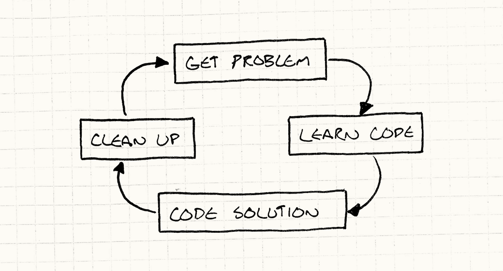

# 介绍

《Game Programming Patterns》分为三个大部分。

第一部分用来介绍并铺垫全书：就是你正在读的这一章，以及下一章。

第二部分 “Design Patterns Revisited（设计模式再探）” 会讲“四人帮”书里的若干模式。每一章里，我都会给出我对某个模式的理解，以及我认为它与游戏编程的关系。

最后一部分才是这本书的真正核心：介绍我认为有用的十三个设计模式。它们被分成四类：Sequencing Patterns（序列模式）、Behavioral Patterns（行为模式）、Decoupling Patterns（解耦模式）和 Optimization Patterns（优化模式）。

每个模式都用一致的结构来描述，这样你可以把本书当作参考手册，快速找到需要的内容：

* Intent（意图）：用“要解决什么问题”来快速概括模式。这放在最前面，便于你快速浏览全书，找到能解决你当前困难的模式。
* Motivation（动机）：描述一个我们将用该模式解决的示例问题。与具体算法不同，模式若不落到某个具体问题上，往往是没有形状的。没有例子就教模式，就像教烘焙却不提面团。这一节提供“面团”，后面的章节会把它烤成成品。
* Pattern（模式）：从前面的例子中提炼出模式的本质。如果你想要干巴巴的教科书式描述，这里就是；如果你已熟悉某模式，这里也适合作为提醒，免得忘了关键配料。
* When to Use It（何时使用）：提供一些判断依据，告诉你什么时候这个模式有用、什么时候最好避免。
* Keep in Mind（注意事项）：指出使用该模式时的后果与风险。
* Sample Code（示例代码）：如果你像我一样需要具体例子才能真正理解，这一节会一步步走完该模式的完整实现，让你看到它到底怎么运作。
* Design Decisions（设计决策）：模式不是单一算法，而是开放式的。每次应用同一模式，你实现的方式可能都不一样。这一节会探索这种空间，展示应用模式时可以考虑的不同选项。
* See Also（另见）：最后用一个短小的章节说明该模式与其他模式的关系，并指向使用它的真实开源代码。

## 架构、性能与游戏

《游戏编程模式》· 引言

在我们一头扎进一堆模式之前，我想先谈谈我如何看待软件架构，以及它如何应用于游戏。这或许能帮助你更好地理解本书其余部分。至少，当你被拖进一场关于设计模式和软件架构有多糟糕（或多出色）的争论时，它也能给你一些弹药。

请注意，我并没有预设你站在哪一边。就像任何军火商一样，我的货卖给所有参战者。

### 什么是软件架构？

如果你把这本书从头到尾读完，你并不会因此掌握 3D 图形背后的线性代数，或游戏物理背后的微积分。它也不会教你如何用 alpha-beta 剪枝来优化 AI 的搜索树，或如何在音频播放中模拟房间的混响。

哇，这一段要是当书的广告，肯定糟透了。

相反，这本书讲的是“那些东西之间”的代码。它与其说是关于“写代码”，不如说是关于“组织代码”。每个程序都有某种组织方式，哪怕只是“把整件事塞进 `main()` 里，看看会发生什么”，所以我认为更有趣的问题是：什么才是好的组织？我们怎么区分好架构和坏架构？

这个问题我琢磨了大约五年。当然，和你一样，我对好设计有一种直觉。我们都经历过那些烂到极点的代码库——你对它们能做的最好事情，就是把它拖到后院，让它解脱。

承认吧，我们大多数人也亲手造出过几份这样的东西。

少数幸运儿有过相反的经历：有机会接触设计精美的代码。那种代码库就像一家布置完美的豪华酒店，礼宾员们热切地候着，随时满足你的每一个念头。两者差别在哪？

### 什么是好的软件架构？

对我来说，好的设计意味着：当我做出一次修改时，就好像整个程序早就预料到了这次改动。我只需调用几个恰到好处的函数，就能完成任务，它们严丝合缝地嵌入其中，在平静的代码水面上连一丝涟漪都不会留下。

这话听起来很美，但并不怎么“可操作”。“只要把你的代码写得让改动不会扰动平静水面就行。”说得轻巧。

让我把它拆开一点。第一个关键点是：架构关乎变化。总得有人在改代码库。如果没人碰这份代码——无论是因为它完美无缺、已经完成，还是烂到没人愿意用编辑器去玷污它——它的设计就无关紧要。衡量设计好坏的标准，是它容纳变化的难易程度。没有变化，就像赛跑者从未离开起跑线。

### 你如何做出一次修改？

在你能改代码、添加新功能、修 bug，或出于任何原因打开编辑器之前，你得先理解现有代码在做什么。当然，你不必了解整个程序，但你需要把相关的部分都加载进你那灵长类的大脑里。

想想还挺怪的：这本质上就是一个 OCR 过程。

我们往往轻描淡写这一步，但它常常是编程里最耗时的部分。如果你觉得把数据从磁盘分页读进内存很慢，那就试试通过一对视神经，把它分页加载进灵长类的大脑皮层吧。

当你把正确的上下文都装进“湿件”（wetware）之后，你会想一会儿，然后想出解决方案。这里可能会有很多来回，但通常这一步相对直接。一旦你理解了问题，以及代码里与之相关的部分，真正的编码有时反而微不足道。

你在键盘上敲一阵子，直到屏幕上亮起正确的彩色灯光，然后就完事了，对吧？还没完！在你写测试、提交代码评审之前，通常还得做些收尾工作。

我说“测试”了吗？是的，我说了。有些游戏代码确实很难写单元测试，但代码库里很大一部分是完全可测的。

我不会在这里站上道德高地，但如果你还没这么做，我会请你考虑多做自动化测试。你难道没有比一遍遍手动验证更值得做的事吗？

你把更多代码塞进了游戏，但你可不想让下一个人被你在源码里留下的褶皱绊倒。除非改动很小，否则通常还需要做一些重组，让你的新代码与程序的其余部分无缝融合。如果你做得对，后来的人应该看不出某一行代码是什么时候写的。

简而言之，编程的流程大致是这样的：

<figure><figcaption></figcaption></figure>

### 解耦能帮上什么忙？

虽然不太显眼，但我认为软件架构有很大一部分都关乎那个“学习阶段”。把代码加载进神经元慢得令人痛苦，所以值得去找策略来减少需要加载的量。本书有一整节都在讲解耦模式，而《设计模式》里也有很大一部分谈的是同一件事。

你可以用很多方式定义“解耦”，但我认为：如果两段代码是耦合的，就意味着你不理解其中一段，就无法理解另一段。若把它们解耦，你就能独立地推理任意一边。这很棒——如果只有其中一段与你的问题相关，你只需把它装进猴子大脑里，而不必连另一半一起装进去。

对我来说，这是软件架构的一个关键目标：尽量减少你在取得进展之前必须装进颅骨里的知识量。

当然，后面的阶段也会受影响。解耦的另一个定义是：改动一段代码，不必连带改另一段。我们显然总得改点什么，但耦合越少，这次改动在游戏其余部分激起的涟漪就越小。

### 代价是什么？

这听起来很棒，对吧？把一切都解耦，你就能疾风般地写代码。每次改动只需要碰一两个精选的方法，你可以在代码库的表面翩翩起舞，连影子都不留下。

正是这种感觉，让人们对抽象、模块化、设计模式和软件架构兴奋起来。架构良好的程序确实是一种愉快的工作体验，人人都喜欢更高效。好架构对生产力的影响巨大，怎么强调都不为过。

但像生活中的一切一样，它不是免费的。好架构需要真正的努力与纪律。每次做改动或实现功能时，你都必须努力让它优雅地融入程序的其余部分。你得非常小心地既把代码组织好，又在构成开发周期的成千上万次小改动中一直保持这种组织。

这后半句——维护你的设计——尤其值得注意。我见过很多程序起步很漂亮，然后在程序员一次又一次加入“就这一丁点小 hack”的过程中，死于千刀万剐。

就像园艺：光种新植物不够，还得除草、修剪。

你必须思考程序的哪些部分应该解耦，并在那些地方引入抽象。同样，你也得判断哪里应该为可扩展性做工程投入，好让未来的改动更容易。

人们对此会非常兴奋。他们想象未来的开发者（或未来的自己）走进代码库，发现它开放、强大，仿佛在招手说“快来扩展我吧”。他们想象着“统治一切的那一个游戏引擎”。

但麻烦也就从这里开始。每当你加一层抽象，或加一个支持扩展的挂点，你都是在推测：以后会需要这份灵活性。你在给游戏增加代码和复杂度，而这些东西都需要时间去开发、调试和维护。

如果你猜对了，并且后来真的会碰那段代码，这笔投入就值得。但预测未来很难；当那种模块化最终并不管用时，它很快就会变成实实在在的负担——毕竟，那是你必须多对付的代码。

有些人发明了口号 “YAGNI”——You aren’t gonna need it（你不会需要它）——用来对抗这种对未来自我需求的臆测冲动。

当人们在这件事上过于狂热时，就会得到一个架构失控的代码库：接口和抽象到处都是，插件系统、抽象基类、虚拟方法泛滥，各种扩展点满天飞。

你得花很久才能穿过所有这些脚手架，找到真正做事的代码。当你需要改东西时，没错，大概会有个接口能帮上忙——但祝你好运找到它。理论上，这些解耦意味着你在扩展之前需要理解的代码更少；但抽象层本身最终会占满你的“心智草稿盘”。

正是这类代码库，让人们开始反对软件架构，尤其是设计模式。很容易沉溺在代码本身里，忘记你真正要做的是把游戏做出来、发货出去。可扩展性的海妖之歌吸走了无数开发者：他们花数年做“引擎”，却始终没搞清楚这引擎到底是为了什么。

### 性能与速度

对软件架构和抽象，还有另一种你有时会听到的批评，尤其是在游戏开发里：它会损害游戏性能。许多让代码更灵活的模式，都依赖虚函数分发、接口、指针、消息等机制，而这些至少都会带来一些运行时开销。

一个有趣的反例是 C++ 的模板。模板元编程有时能给你接口式的抽象，却不在运行时付出代价。

这里有一条灵活性的光谱。当你写代码去调用某个类的具体方法时，你是在编写时就固定了那个类——你硬编码了要调用谁。当你通过虚方法或接口时，真正被调用的类要到运行时才知道。这灵活得多，但也意味着一些运行时开销。

模板元编程介于两者之间：你在模板实例化时、在编译期决定调用哪个类。

这是有原因的。很多软件架构都在让程序更灵活，让改动更省力。这意味着在程序里编码更少的假设。你用接口，是为了让代码能与任何实现该接口的类协作，而不只是今天这一个。你用观察者和消息机制，是为了让游戏的两部分能对话，好让明天轻松变成三部分或四部分。

但性能全靠假设。优化实践靠的是具体限制。我们能安全假设敌人永远不会超过 256 个吗？太好了，ID 可以塞进一个字节。这里我们只会在一个具体类型上调用方法吗？很好，可以静态分发或内联。所有实体都是同一个类吗？太棒了，可以做成漂亮的连续数组。

但这并不意味着灵活性不好！它让我们能快速改游戏，而开发速度对做出有趣体验绝对至关重要。没有人——哪怕是 Will Wright——能在纸上凭空想出一套平衡的游戏设计。它需要迭代与实验。

你能越快尝试想法并感受手感，就能试得越多，也就越可能找到真正出色的东西。即便找到了正确的机制，你也需要大量时间调参。一点小小的失衡就能毁掉游戏的乐趣。

这里没有简单答案。让程序更灵活以便更快原型，会有一些性能代价；同理，优化代码也会让它更不灵活。

不过以我的经验：把好玩的游戏做快，比把快的游戏做好玩更容易。一种折中是：在设计稳定下来之前保持代码灵活，然后再撕掉一些抽象来提升性能。

### 坏代码里的好

这就引出下一点：不同的编码风格各有其时其地。本书很大一部分谈的是可维护、干净的代码，所以我的立场显然偏向“正确”的做法，但仓促潦草的代码也有价值。

写架构良好的代码需要仔细思考，而这会转化为时间。更进一步，在项目生命周期里维持好架构也需要大量努力。你得像个好露营者对待营地那样对待代码库：总是尽量让它比你发现时更好一点。

当你要长期住在并维护那份代码时，这很好。但正如前面所说，游戏设计需要大量实验与探索。尤其是早期，写出你知道最终会扔掉的代码很常见。

如果你只想弄清某个玩法想法到底好不好玩，却先把它架构得很漂亮，就意味着在真正上屏、拿到反馈之前烧掉更多时间。若它最终行不通，那些花在让代码优雅上的时间，会在你删除它时一起浪费掉。

原型开发——把刚好能回答一个设计问题的代码拼凑起来——是一种完全正当的编程实践。不过有一个很大的但书：如果你写的是一次性代码，你必须确保你真的能扔掉它。我见过糟糕的管理者一遍又一遍玩这套：

老板：“嘿，我们有个想法想试一试。只是原型，所以别觉得一定要做对。你能多快拼出点东西？”

开发：“嗯，如果我砍很多角、不测试、不写文档，而且 bug 成堆，我可以几天内给你一些临时代码。”

老板：“太好了！”

几天过去……

老板：“嘿，那个原型很棒。你能不能再花几个小时稍微收拾一下，我们就把它当正式版了？”

你必须确保使用这份一次性代码的人明白：虽然它看起来好像能用，但它不可维护，必须重写。如果有可能最终得一直留着它，你或许就得防御性地把它写好。

确保原型代码不会被迫变成正式代码的一个技巧是：用与游戏不同的语言来写。这样，在它能进入真正游戏之前，你就不得不重写它。

### 取得平衡

我们面前有几股力量：

* 我们想要良好的架构，好让代码在整个项目生命周期里更容易理解。
* 我们想要快的运行时性能。
* 我们想尽快做完今天的功能。

我觉得有趣的是，这些都关乎某种速度：长期开发速度、游戏执行速度，以及短期开发速度。

这些目标至少部分互相冲突。好架构提升长期生产力，但维护它意味着每次改动都要多花一点力气保持整洁。

写起来最快的实现，很少是跑起来最快的。相反，优化需要大量工程时间。一旦做完，它往往还会让代码库硬化：高度优化的代码不灵活，也极难改动。

总有压力要你把今天的活今天做完，其他事明天再想。但如果我们尽可能快地塞功能，代码库就会变成一堆 hack、bug 和不一致，从而榨干我们未来的生产力。

这里没有简单答案，只有权衡。从我收到的邮件看，这让很多人灰心。尤其是只想做个游戏的新手，听到“没有正确答案，只有不同味道的错误”会让人害怕。

但对我来说，这很令人兴奋！看看任何人们愿意投入职业生涯去精通的领域，中心总会有一组纠缠在一起的约束。毕竟，如果有简单答案，人人都会那么做。一周就能精通的领域最终是无聊的。你很少听说谁有“挖沟”方面的杰出职业生涯。

也许有人有；我没去考证这个类比。说不定真有狂热的挖沟爱好者、挖沟大会，以及一整套亚文化。我凭什么评判？

对我来说，这和游戏本身很像。像国际象棋这样的游戏永远无法被彻底精通，因为棋子之间彼此完美制衡。这意味着你可以花一生去探索广阔的可行策略空间。设计糟糕的游戏则会坍缩成一种必胜套路，一遍遍重复，直到你无聊退出。

### 简洁

近来我感觉，若有什么方法能缓和这些约束，那就是简洁。在我今天的代码里，我非常努力地写出对问题最干净、最直接的解。那种读完之后，你就确切知道它在做什么，并且想不出任何其他可能解法的代码。

我力求先把数据结构和算法做对（大致按这个顺序），然后从那里继续。我发现如果能保持简单，总体代码就更少。这意味着为了改它而要装进脑子的代码也更少。

它往往也跑得快，因为开销本来就少，要执行的代码也不多。（当然并非总是如此。你也可以在很少的代码里塞进大量循环和递归。）

不过要注意：我并不是说简洁的代码写起来更省时间。你可能会这么想，因为最终代码总量更少；但好方案不是代码的堆积，而是对代码的提炼。

布莱兹·帕斯卡有句名言，他在一封信的结尾写道：“我本可以写得更短，但我没有时间。”

另一句常被引用的话来自安托万·德·圣埃克苏佩里：“完美不是再也加不进去什么，而是再也拿不掉什么。”

说到更近的事：我会注意到，每次我修订本书的某一章，它都会变短。有些章节定稿时会收紧大约 20%。

我们很少面对一个优雅的问题。相反，它是一堆用例。你想要 X 在 Z 时做 Y，但在 A 时做 W，如此等等。换句话说，是一长串不同的示例行为。

最省脑力的解法，就是把这些用例一个个写出来。如果你看新手程序员，他们常常就是这么干的：脑子里冒出什么情况，就吐出大段针对该情况的条件逻辑。

但那里头毫无优雅可言；而且这种风格的代码，一旦输入与编码者考虑过的例子稍有不同，往往就会倒下。当我们想到优雅解法时，心里常常想的是一个通用方案：一小段逻辑，却正确覆盖一大片用例空间。

找到它有点像模式匹配或解谜。你需要努力透过零散的示例用例，看见它们之下隐藏的秩序。当你做到时，那种感觉很棒。

### 好了，赶紧开始吧

几乎人人都会跳过引言章节，所以恭喜你走到了这里。对你的耐心，我也没什么厚礼可回，但可以送上几条建议，希望对你有用：

* 抽象和解耦能让程序演进更快、更容易，但除非你确信相关代码真的需要那份灵活性，否则别浪费时间去做。
* 在整个开发周期里都要思考并为性能做设计，但把那些会把假设锁死进代码的底层、琐碎优化，尽量拖到尽可能晚。

相信我：离发货还有两个月时，才开始担心那个烦人的“游戏只能跑 1 FPS”问题，可不是时候。

* 快速行动，去探索你游戏的设计空间，但别快到身后留下一地烂摊子。毕竟你还得和它一起生活。
* 如果你打算扔掉代码，就别浪费时间把它弄漂亮。摇滚明星把酒店房间砸得稀烂，是因为他们知道第二天就要退房。

但最重要的是：如果你想做出好玩的东西，那就在制作过程中玩得开心。

