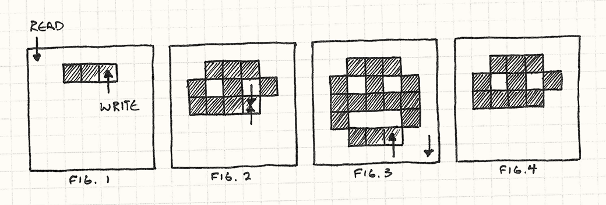

# 双缓冲

### 意图

让一系列依次执行的操作看起来像是瞬间完成或同时完成的。

### 动机

从本质上说，计算机是一种顺序执行的机器。它的强大之处，在于能够把最庞大的任务拆解成许多微小步骤，再逐一执行。然而，用户经常需要看到某件事在一瞬间完成，或者看到多项任务同时进行。

随着多线程和多核架构的发展，这种说法已经不像过去那么绝对。不过，即使拥有多个核心，同一时间真正并发运行的操作仍然只有少数几个。

一个典型的例子——也是每个游戏引擎都必须处理的问题——就是渲染。游戏绘制玩家看到的世界时，会逐一绘制其中的各个部分：远处的群山、连绵的丘陵、树木，依次进行。

如果玩家能看到画面像这样一点点绘制出来，完整世界所带来的幻觉就会被打破。场景必须平滑而迅速地更新，呈现一系列完整的帧，而且每一帧都应该像是在瞬间出现的。

双缓冲模式（Double Buffer）能够解决这个问题。不过，要理解它如何工作，首先需要回顾计算机显示图形的方式。

### 计算机图形的工作原理（简述）

计算机显示器之类的视频显示设备一次绘制一个像素。它从左向右扫描一行像素，然后移动到下一行。抵达右下角后，又返回左上角，重新开始整个过程。

这个过程非常快——大约每秒六十次——因此我们的眼睛无法察觉扫描过程。在我们看来，屏幕就是一片静止的彩色像素区域，也就是一幅完整图像。

这个解释，呃，有些“简化”。如果你是底层硬件专家，现在正听得浑身难受，可以直接跳到下一节。你已经掌握了理解本章其余内容所需的知识。如果你不是这样的人，那么我这里只打算提供足够的背景，帮助你理解后面要讨论的模式。

你可以把这个过程想象成一根将像素输送到显示器的小水管。各种颜色从水管后端进入，然后被依次喷洒到显示器上，为每个像素喷上一点颜色。

那么，这根水管怎么知道应该把什么颜色喷到什么位置呢？

在大多数计算机中，答案是从帧缓冲区（framebuffer）读取。帧缓冲区是内存中的一个像素数组，也就是 RAM 中的一块区域，其中每几个字节代表一个像素的颜色。水管扫过显示器时，会从这个数组中逐字节读取颜色值。

字节值与颜色之间的具体映射关系，由系统的像素格式和颜色深度决定。在如今的大多数游戏主机中，每个像素占用 32 位：红、绿、蓝三个通道各占 8 位，另外还剩 8 位用于其他用途。

归根结底，要让游戏出现在屏幕上，我们所做的一切就是写入这个数组。所有疯狂而先进的图形算法，最终都归结为同一件事：设置帧缓冲区中的字节值。

不过，这里有一个小问题。

前面说过，计算机按顺序执行操作。如果机器正在执行一段渲染代码，我们通常不会认为它同时还在做其他事情。这基本准确，但在程序运行期间，仍然会有少数操作同时发生。

其中之一，就是视频显示设备会在游戏运行时持续读取帧缓冲区。这可能给我们带来麻烦。

假设我们想在屏幕上显示一张笑脸。程序开始遍历帧缓冲区，为像素着色。但我们没有意识到，视频驱动程序恰好也在我们写入帧缓冲区时读取它。

当它扫描到那些已经写入的像素时，笑脸开始显现。但随后，它的读取进度超过了我们的写入进度，进入了那些尚未写入的像素区域。最终就会产生画面撕裂（tearing）：一种难看至极的视觉缺陷，屏幕上只能看到某个图像绘制了一半。

<figure><figcaption></figcaption></figure>

这正是我们需要双缓冲模式的原因。程序每次渲染一个像素，但我们希望显示驱动程序一次看到全部像素：这一帧还没有笑脸，下一帧笑脸就完整地出现了。

双缓冲可以解决这个问题。下面用一个类比来解释它。

### 第一幕，第一场

想象一下，观众正在观看一场由我们制作的舞台剧。第一场结束、第二场开始时，需要更换舞台布景。如果第一场刚结束，舞台工作人员就跑上台拖动各种道具，完整场景营造的幻觉便会被打破。

我们可以在换景时调暗灯光——现实中的剧院当然就是这么做的——但观众仍然知道舞台上正在发生什么。我们希望两场戏之间完全没有时间间隔。

只要再多占用一点空间，就能想出一个巧妙的解决方案：搭建两个观众都能看到的舞台，每个舞台都有一套独立的灯光。我们称它们为舞台 A 和舞台 B。

第一场戏在舞台 A 上演。与此同时，舞台 B 一片漆黑，工作人员正在那里布置第二场。第一场结束的瞬间，我们关闭舞台 A 的灯光，同时点亮舞台 B。观众转向新舞台，第二场戏立刻开始。

与此同时，工作人员来到已经变暗的舞台 A，拆除第一场的布景，并开始搭建第三场。第二场结束时，我们再次切换灯光，重新点亮舞台 A。

整场演出都重复这个过程，把处于黑暗中的舞台作为工作区，用于布置下一场戏。每次切换场景时，只需切换两个舞台的灯光。

这样，观众就能看到一场连续不断、场景之间没有延迟的演出。他们永远不会看到舞台工作人员。

如果使用半透半反镜，再配合十分巧妙的布局，甚至可以让两个舞台在观众眼中位于同一个位置。灯光切换后，他们看到的实际上已经是另一个舞台，却完全不需要改变视线方向。

至于如何搭建，就留给读者作为练习吧。

### 回到计算机图形

双缓冲的工作方式与此完全相同。几乎你见过的每一款游戏，其渲染系统底层都使用了这一过程。

我们不再只有一个帧缓冲区，而是拥有两个。其中一个表示当前帧，也就是类比中的舞台 A。视频硬件会从中读取数据。GPU 可以随时按照自己的需要反复扫描它。

不过，并非所有游戏和主机都这样工作。对于内存有限的老旧或简单主机，开发者会让绘制过程与视频刷新精确同步。这种做法相当棘手。

与此同时，渲染代码会写入另一个帧缓冲区，也就是处于黑暗中的舞台 B。

渲染代码绘制完场景后，会通过交换缓冲区来“切换灯光”。这会通知视频硬件：现在开始从第二个缓冲区读取，而不再从第一个缓冲区读取。

只要交换操作发生在一次刷新结束时，就不会产生画面撕裂，整个场景会一次性完整出现。

与此同时，原来的帧缓冲区现在空闲了，可以用于渲染下一帧。瞧！

### 模式

一个缓冲类封装了一块缓冲区，也就是一份可以修改的状态。这块缓冲区会被逐步编辑，但我们希望所有外部代码看到的修改是一次不可分割的原子变化。

为此，该类维护两份缓冲区实例：

* 下一缓冲区；
* 当前缓冲区。

读取信息时，始终从当前缓冲区读取。写入信息时，则始终写入下一缓冲区。

修改完成后，通过一次交换操作瞬间互换下一缓冲区与当前缓冲区，使新缓冲区对外可见。原来的当前缓冲区则可以被复用，成为新的下一缓冲区。

### 何时使用

对于这种模式，需要它时通常一眼就能看出来。如果系统缺少双缓冲，它很可能会出现明显的视觉错误——例如画面撕裂——或者表现出不正确的行为。

不过，“需要时自然就会知道”并不能提供多少实际指导。更具体地说，当以下条件全部成立时，适合使用该模式：

* 某份状态正在被逐步修改。
* 同一份状态可能在修改过程中被访问。
* 我们不希望访问状态的代码看到尚未完成的中间结果。
* 我们希望能够读取状态，而不必等待写入过程完成。

### 注意事项

与规模更大的架构模式不同，双缓冲位于更底层的实现层面。因此，它对代码库其他部分产生的影响较少——游戏的大部分代码甚至不会意识到是否使用了双缓冲。

不过，仍然有几个需要注意的地方。

#### 交换操作本身需要时间

使用双缓冲时，状态修改完成后必须执行一次交换。这个操作必须是原子的：交换过程中，任何代码都不能访问其中任何一份状态。

通常，交换只需给指针赋值，因此速度非常快。但如果交换所需的时间比修改状态本身还长，那这种模式就完全没有帮上忙。

#### 必须拥有两个缓冲区

该模式的另一个影响是会增加内存占用。顾名思义，它要求内存中始终保存两份状态副本。

在内存受限的设备上，这可能是非常沉重的代价。如果无法负担两块缓冲区，就必须寻找其他方法，确保状态在修改过程中不会被访问。

### 示例代码

了解理论之后，接下来看看它在实践中如何工作。

我们将编写一个极其精简的图形系统，用于在帧缓冲区中绘制像素。在大多数游戏主机和 PC 上，图形系统的这一底层部分由视频驱动程序提供。不过，在这里亲自实现它，能让我们清楚地看到其中发生了什么。

首先是缓冲区本身：

```cpp
// Some code
class Framebuffer
{
public:
  Framebuffer() { clear(); }

  void clear()
  {
    for (int i = 0; i < WIDTH * HEIGHT; i++)
    {
      pixels_[i] = WHITE;
    }
  }

  void draw(int x, int y)
  {
    pixels_[(WIDTH * y) + x] = BLACK;
  }

  const char* getPixels()
  {
    return pixels_;
  }

private:
  static const int WIDTH = 160;
  static const int HEIGHT = 120;

  char pixels_[WIDTH * HEIGHT];
};
```

它提供了两项基本操作：

* 将整个缓冲区清除为默认颜色；
* 设置单个像素的颜色。

它还提供了 `getPixels()` 函数，用于公开保存像素数据的原始内存数组。示例中不会展示这一过程，但视频驱动程序会频繁调用该函数，将缓冲区中的内存数据传输到屏幕。

接下来，我们用 `Scene` 类封装这块原始缓冲区。它在这里的职责，是通过对缓冲区进行一系列 `draw()` 调用来渲染图像：

```cpp
// Some code
class Scene
{
public:
  void draw()
  {
    buffer_.clear();

    buffer_.draw(1, 1);
    buffer_.draw(4, 1);
    buffer_.draw(1, 3);
    buffer_.draw(2, 4);
    buffer_.draw(3, 4);
    buffer_.draw(4, 3);
  }

  Framebuffer& getBuffer() { return buffer_; }

private:
  Framebuffer buffer_;
};
```

每一帧，游戏都会通知场景进行绘制。场景先清空缓冲区，然后逐个绘制一组像素。它还通过 `getBuffer()` 提供对内部缓冲区的访问，以便视频驱动程序读取数据。

这看起来很简单，但如果保持现状，就会遇到问题。视频驱动程序可能随时对缓冲区调用 `getPixels()`，甚至可能恰好发生在这里：

```cpp
// Some code
buffer_.draw(1, 1);
buffer_.draw(4, 1);
// ← 视频驱动程序在这里读取像素！
buffer_.draw(1, 3);
buffer_.draw(2, 4);
buffer_.draw(3, 4);
buffer_.draw(4, 3);
```

发生这种情况时，玩家会看到笑脸的眼睛，但嘴巴会消失一帧。下一帧，绘制过程又可能在另一个位置被打断。最终结果就是画面发生严重闪烁。

我们用双缓冲来修复它：

```cpp
// Some code
class Scene
{
public:
  Scene()
  : current_(&buffers_[0]),
    next_(&buffers_[1])
  {}

  void draw()
  {
    next_->clear();

    next_->draw(1, 1);
    // ……
    next_->draw(4, 3);

    swap();
  }

  Framebuffer& getBuffer() { return *current_; }

private:
  void swap()
  {
    // 只需交换指针。
    Framebuffer* temp = current_;
    current_ = next_;
    next_ = temp;
  }

  Framebuffer  buffers_[2];
  Framebuffer* current_;
  Framebuffer* next_;
};
```

现在，`Scene` 拥有两个缓冲区，存储在 `buffers_` 数组中。我们不会直接通过数组引用它们，而是使用指向数组元素的两个成员：`next_` 和 `current_`。

进行绘制时，我们会绘制到 `next_` 引用的下一缓冲区。视频驱动程序需要获取像素时，则始终通过 `current_` 访问另一个缓冲区。

这样，视频驱动程序永远不会看到我们正在修改的缓冲区。最后一块拼图，是场景完成一帧绘制后对 `swap()` 的调用。它只需交换 `next_` 和 `current_` 两个指针，就能互换缓冲区。

视频驱动程序下一次调用 `getBuffer()` 时，会得到我们刚刚完成绘制的新缓冲区，并将其显示到屏幕上。画面撕裂和难看的视觉缺陷从此消失。

### 不仅适用于图形

双缓冲解决的核心问题，是某份状态在修改过程中遭到访问。通常有两个原因会导致这种情况。

第一个原因已经在图形示例中见过：其他线程或中断中的代码直接访问了这份状态。

还有另一个同样常见的原因：修改状态的代码本身，也在访问它正在修改的同一份状态。这种问题可能出现在许多地方，尤其是物理和 AI 系统中，因为其中的实体会彼此交互。双缓冲在这些场景中也经常很有帮助。

### 人工“不智能”

假设我们正在为一款以闹剧喜剧为主题的游戏构建行为系统。游戏中有一个舞台，上面站着一群演员。他们四处奔跑，进行各种恶作剧和胡闹。

下面是演员的基类：

```cpp
// Some code
class Actor
{
public:
  Actor() : slapped_(false) {}

  virtual ~Actor() {}
  virtual void update() = 0;

  void reset()      { slapped_ = false; }
  void slap()       { slapped_ = true; }
  bool wasSlapped() { return slapped_; }

private:
  bool slapped_;
};
```

游戏负责每帧调用每个演员的 `update()`，让其有机会执行一些处理。最重要的是，从玩家的角度来看，所有演员都应该像是同时更新的。

这是更新方法模式（Update Method）的一个例子。

演员之间还可以进行“互动”——如果我们所说的“互动”是指互相扇耳光的话。

演员在更新时，可以对另一个演员调用 `slap()` 来扇对方耳光，也可以调用 `wasSlapped()` 判断自己是否挨了耳光。

演员们需要一个能够相互互动的舞台，所以我们来构建一个：

```cpp
// Some code
class Stage
{
public:
  void add(Actor* actor, int index)
  {
    actors_[index] = actor;
  }

  void update()
  {
    for (int i = 0; i < NUM_ACTORS; i++)
    {
      actors_[i]->update();
      actors_[i]->reset();
    }
  }

private:
  static const int NUM_ACTORS = 3;

  Actor* actors_[NUM_ACTORS];
};
```

`Stage` 允许我们添加演员，并提供单个 `update()` 调用来更新所有演员。对于玩家来说，演员似乎同时移动；但在内部，它们实际上是逐个更新的。

还有一点需要注意：每个演员的“被扇”状态会在该演员更新后立即清除。这样，每次挨耳光时，演员只会响应一次。

为了让表演开始，我们来定义一个具体的演员子类。这位喜剧演员的行为非常简单：他面朝一名演员。每当他被任何人扇了耳光，就会反过来扇自己面朝的那名演员。

```cpp
// Some code
class Comedian : public Actor
{
public:
  void face(Actor* actor) { facing_ = actor; }

  virtual void update()
  {
    if (wasSlapped()) facing_->slap();
  }

private:
  Actor* facing_;
};
```

现在，把几名喜剧演员放到舞台上，看看会发生什么。我们设置三名演员，让每个人都面朝下一位，最后一位则面朝第一位，从而形成一个大圆环：

```cpp
// Some code
Stage stage;

Comedian* harry = new Comedian();
Comedian* baldy = new Comedian();
Comedian* chump = new Comedian();

harry->face(baldy);
baldy->face(chump);
chump->face(harry);

stage.add(harry, 0);
stage.add(baldy, 1);
stage.add(chump, 2);
```

最终的舞台布局如下图所示。箭头表示每名演员面朝谁，数字则表示他们在舞台数组中的索引。

<figure><figcaption></figcaption></figure>

我们先扇 Harry 一耳光，让表演开始，然后看看处理过程会发生什么：

```
// Some code
harry->slap();

stage.update();
```

请记住，`Stage` 的 `update()` 函数会依次更新每名演员。逐步执行代码时，会发生以下过程：

```
// Some code
Stage 更新演员 0（Harry）
  Harry 挨了耳光，因此他扇了 Baldy

Stage 更新演员 1（Baldy）
  Baldy 挨了耳光，因此他扇了 Chump

Stage 更新演员 2（Chump）
  Chump 挨了耳光，因此他扇了 Harry

Stage 更新结束
```

仅仅一帧之内，最初扇在 Harry 脸上的耳光就传遍了所有喜剧演员。

现在，我们稍微改变一下情况：调整喜剧演员在舞台数组中的顺序，但让他们仍然保持原来的朝向关系。

<figure><figcaption></figcaption></figure>

我们保持舞台的其他设置不变，只把添加演员的代码替换为：

```
// Some code
stage.add(harry, 2);
stage.add(baldy, 1);
stage.add(chump, 0);
```

再运行一次实验，看看会发生什么：

```
// Some code
Stage 更新演员 0（Chump）
  Chump 没有挨耳光，因此什么也不做

Stage 更新演员 1（Baldy）
  Baldy 没有挨耳光，因此什么也不做

Stage 更新演员 2（Harry）
  Harry 挨了耳光，因此他扇了 Baldy

Stage 更新结束
```

糟糕，结果完全不同。

问题很直接。更新演员时，我们会修改他们的“被扇”状态，而这恰恰也是更新过程中需要读取的状态。因此，在一次更新的早期对状态作出的修改，会影响同一次更新中后续执行的部分。

如果继续更新舞台，就会看到耳光逐帧在演员之间传递，每帧传播一次。第一帧，Harry 扇 Baldy；下一帧，Baldy 扇 Chump；以此类推。

最终，一名演员可能在挨耳光的同一帧作出反应，也可能到下一帧才作出反应。这完全取决于两名演员在舞台数组中碰巧以什么顺序排列。

这违反了我们的要求：演员应该表现得像是在并行运行。同一帧内的更新顺序不应该影响结果。

### 缓冲耳光

幸运的是，双缓冲模式可以帮忙。这一次，我们不再保存两份庞大的整体“缓冲区”对象，而是采用细得多的缓冲粒度：分别缓冲每名演员的“被扇”状态。

```cpp
// Some code
class Actor
{
public:
  Actor() : currentSlapped_(false) {}

  virtual ~Actor() {}
  virtual void update() = 0;

  void swap()
  {
    // 交换缓冲区。
    currentSlapped_ = nextSlapped_;

    // 清除新的“下一”缓冲区。
    nextSlapped_ = false;
  }

  void slap()       { nextSlapped_ = true; }
  bool wasSlapped() { return currentSlapped_; }

private:
  bool currentSlapped_;
  bool nextSlapped_;
};
```

现在，每名演员都拥有两份状态，而不再只有一个 `slapped_`。和此前的图形示例一样，当前状态用于读取，下一状态用于写入。

`reset()` 函数被替换成了 `swap()`。现在，清除下一状态之前，它会先将下一状态复制到当前状态，使其成为新的当前状态。

这还需要对 `Stage` 作出一项小改动：

```cpp
// Some code
void Stage::update()
{
  for (int i = 0; i < NUM_ACTORS; i++)
  {
    actors_[i]->update();
  }

  for (int i = 0; i < NUM_ACTORS; i++)
  {
    actors_[i]->swap();
  }
}
```

`update()` 现在会先更新所有演员，然后再统一交换他们的状态。

最终，一名演员只会在实际挨耳光之后的下一帧看到这记耳光。这样，无论演员在舞台数组中按什么顺序排列，他们的行为都会保持一致。

在玩家或任何外部代码看来，所有演员都在同一帧内同时完成了更新。

### 设计决策

双缓冲模式相当直接。前面的示例已经涵盖了你可能遇到的大部分变化。实现该模式时，主要需要作出两项决策。

#### 如何交换缓冲区？

交换操作是整个过程最关键的一步，因为执行交换时，必须禁止任何代码读取或修改两个缓冲区。为了获得最佳性能，我们希望交换尽可能迅速。

**交换指向缓冲区的指针或引用**

图形示例采用的就是这种方式，也是图形双缓冲最常见的解决方案。

速度很快。 无论缓冲区有多大，交换都只需要进行几次指针赋值。就速度和简洁性而言，很难找到比这更好的方案。

外部代码不能持久保存指向缓冲区的指针。 这是它的主要限制。因为我们没有真正移动数据，本质上只是在定期通知代码库的其他部分：“现在请去另一个位置查看缓冲区。”这与最初的双舞台类比相同。

因此，其他代码不能直接保存指向缓冲区内部数据的指针，因为下一刻，这些指针可能就会指向错误的缓冲区。

如果视频驱动程序要求帧缓冲区始终位于固定的内存地址，这会尤其麻烦。在这种情况下，就无法使用该方案。

缓冲区中已有的数据来自两帧之前，而不是上一帧。 连续帧会交替绘制到两个缓冲区，而且两者之间不会复制数据：

```
// Some code
第 1 帧绘制到缓冲区 A
第 2 帧绘制到缓冲区 B
第 3 帧绘制到缓冲区 A
……
```

可以看到，当我们准备绘制第三帧时，缓冲区中已有的数据来自第一帧，而不是时间上更接近的第二帧。

多数情况下，这不是问题，因为我们通常会在绘制前清空整个缓冲区。但如果打算复用缓冲区中的部分已有数据，就必须考虑到这些数据比预期的还要旧一帧。

旧帧缓冲区数据的一种经典用途，是模拟运动模糊。将当前帧与此前渲染帧的一小部分混合，得到的图像会更像真实摄像机拍摄的效果。

**在缓冲区之间复制数据**

如果不能让使用者转而访问另一个缓冲区，唯一的选择就是将下一帧的数据实际复制到当前帧。

闹剧喜剧演员的示例采用的就是这种方式。我们选择它，是因为需要复制的状态只有一个布尔标志，复制它并不比复制一个缓冲区指针更耗时。

下一缓冲区中的数据只比当前帧旧一帧。 与让两个缓冲区来回交替相比，这是复制数据的优势。如果需要访问上一份缓冲区数据，这种方式可以提供更新的数据。

交换可能耗费更多时间。 这当然是其最大的缺点。现在，交换操作意味着在内存中复制整个缓冲区。

如果缓冲区很大——例如完整的帧缓冲区——复制可能会耗费大量时间。由于复制过程中两个缓冲区都不能被读写，这是一项严重限制。

#### 缓冲区的粒度应该多大？

另一个问题是缓冲区本身如何组织：它是一块整体的数据，还是分散在一组对象中？

图形示例使用前一种方式，演员示例使用后一种方式。

大多数情况下，被缓冲内容的性质会自然决定答案，但仍然存在一定的选择空间。例如，所有演员也可以把消息保存在同一块消息缓冲区中，然后分别通过自己在数组中的索引访问它。

**如果缓冲区是一个整体**

交换更加简单。 因为只有一对缓冲区，所以一次操作就能完成交换。如果可以通过修改指针来交换，那么无论整个缓冲区有多大，都只需要几次赋值。

**如果许多对象分别拥有一小部分数据**

交换速度较慢。 为了交换缓冲状态，必须遍历整个对象集合，通知每个对象执行交换。

在喜剧演员示例中，这没有问题，因为我们无论如何都需要清除下一帧的被扇状态——每一份缓冲状态本来就必须每帧访问一次。

如果原本不需要接触旧缓冲区，就可以采用一种简单优化，在把缓冲区分散到多个对象中的同时，获得与整体缓冲区相同的交换性能。

其思路是将“当前”和“下一”指针的概念应用到每个对象，把它们变成相对于对象自身的偏移量：

```cpp
// Some code
class Actor
{
public:
  static void init() { current_ = 0; }
  static void swap() { current_ = next(); }

  void slap()        { slapped_[next()] = true; }
  bool wasSlapped()  { return slapped_[current_]; }

private:
  static int current_;
  static int next()  { return 1 - current_; }

  bool slapped_[2];
};
```

演员使用 `current_` 作为状态数组的索引，访问当前的被扇状态。下一状态始终位于数组中的另一个索引，因此可以通过 `next()` 计算出来。

交换状态时，只需在两个 `current_` 索引值之间进行切换。

巧妙之处在于，`swap()` 现在是静态函数。它只需要调用一次，就能交换所有演员的状态。

### 另请参阅

几乎所有图形 API 都在使用双缓冲模式。例如：

* OpenGL 提供了 `swapBuffers()`；
* Direct3D 使用“交换链”（swap chain）；
* Microsoft 的 XNA 框架会在 `endDraw()` 方法中交换帧缓冲区。


